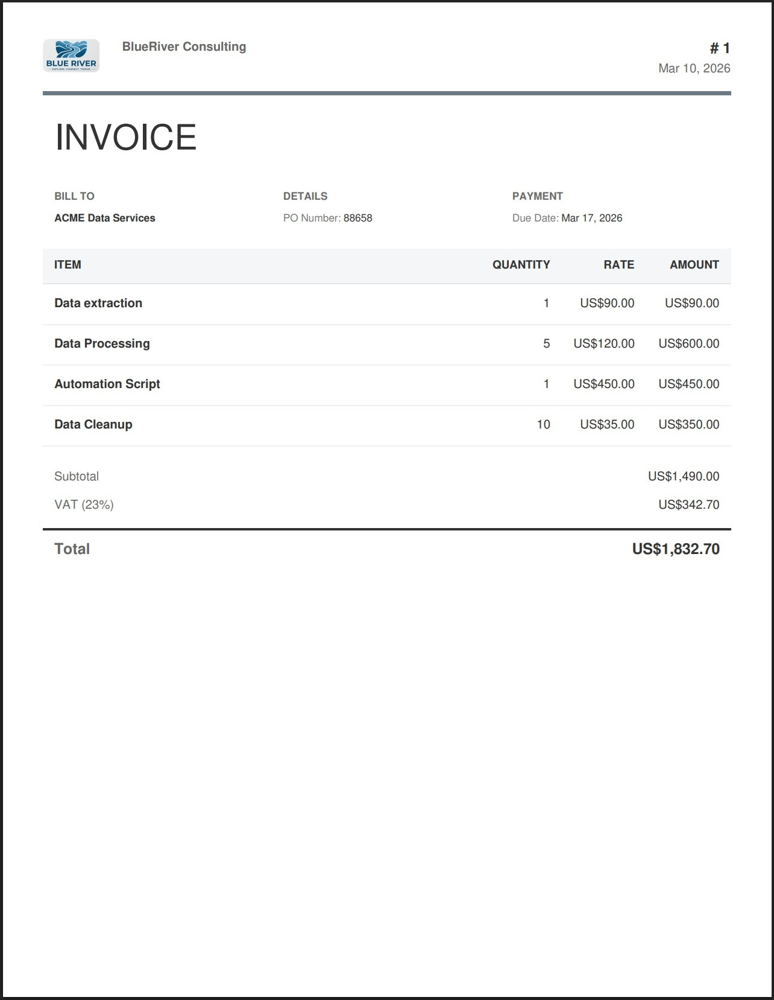
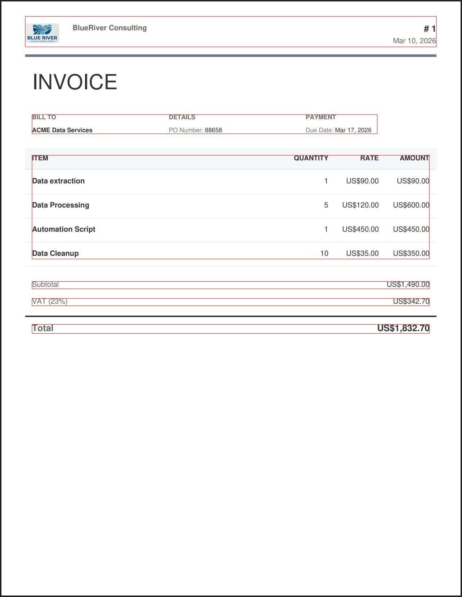
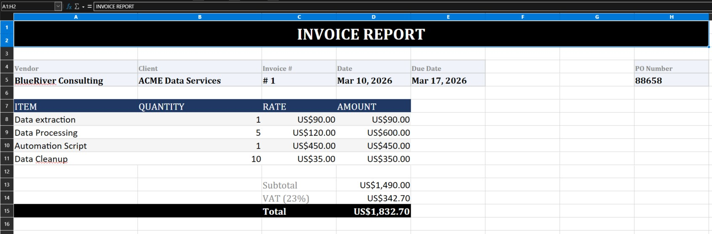

# Python Invoice PDF Data Extractor

Extract structured data from real-world PDF invoices and export it to a formatted Excel report — automatically, using Python.

This project is a **production-style example** of how to process invoices you did not generate yourself:

- accounting automation
- accounts payable pipelines
- ERP data entry replacement
- batch invoice processing
- financial reporting workflows

---

## How it works

Most PDF extraction tutorials work on clean, predictable files. This example works on a **real invoice from an external source** — a PDF the script has never seen before.

The extraction is dynamic: instead of hardcoding coordinates, the script locates each section of the document by finding known anchor words and computing bounding boxes at runtime.

**Step 1 — Input: a real invoice PDF**



**Step 2 — Debug: bounding boxes visualised during development**

Each region (header, details, line items, totals) is detected and cropped dynamically.



**Step 3 — Output: a formatted Excel report**



---

## What gets extracted

| Field | Source |
|---|---|
| Vendor | Document header |
| Invoice number | Document header |
| Invoice date | Document header |
| Client | Bill To section |
| PO Number | Details section |
| Due Date | Payment section |
| Line items | Table (Item, Quantity, Rate, Amount) |
| Subtotal / VAT / Total | Summary section |

---

## Quick Start

```bash
git clone https://github.com/hasff/python-invoice-pdf-data-extractor.git
cd python-invoice-pdf-data-extractor
python -m venv venv
source venv/bin/activate   # Windows: venv\Scripts\activate
pip install -r requirements.txt
python extract_invoice.py
```

The script will read from:

```
input/Invoice_sample.pdf
```

And generate:

```
output/example_output.xlsx
```

---

## Technical approach

Rather than relying on table detection or AI-based extraction, this project uses a **coordinate-based region extraction** strategy:

- Anchor words (e.g. `BILL TO`, `ITEM`, `Subtotal`) are located by scanning the word list
- Bounding boxes are computed dynamically from those anchor positions
- Each region is cropped and parsed independently using `pdfplumber`
- Words within each region are grouped into lines and cells based on spatial proximity

This approach is predictable, debuggable, and does not require an internet connection or API key.

---

## Need custom PDF data extraction?

I help companies automate document processing pipelines:

- invoice and receipt extraction
- batch processing of large PDF archives
- integration with databases, APIs and ERP systems
- OCR for scanned documents
- export to Excel, CSV or JSON

📩 Contact: hugoferro.business(at)gmail.com

🌐 Courses and professional tools: https://hasff.github.io/site/

---

## Further Learning

This repository is based on techniques covered in my full course:

[**Python PDF Handling: From Beginner to Winner (PyMuPDF)**](https://www.udemy.com/course/python-pdf-handling-from-beginner-to-winner/?referralCode=E7B71DCA8314B0BAC4BD)

The course covers text and image extraction, page manipulation, OCR from scans, high-speed batch processing, and how to debug complex extraction problems when documentation runs out.

The repository is fully usable on its own — the course provides the deeper understanding behind the decisions made here.
